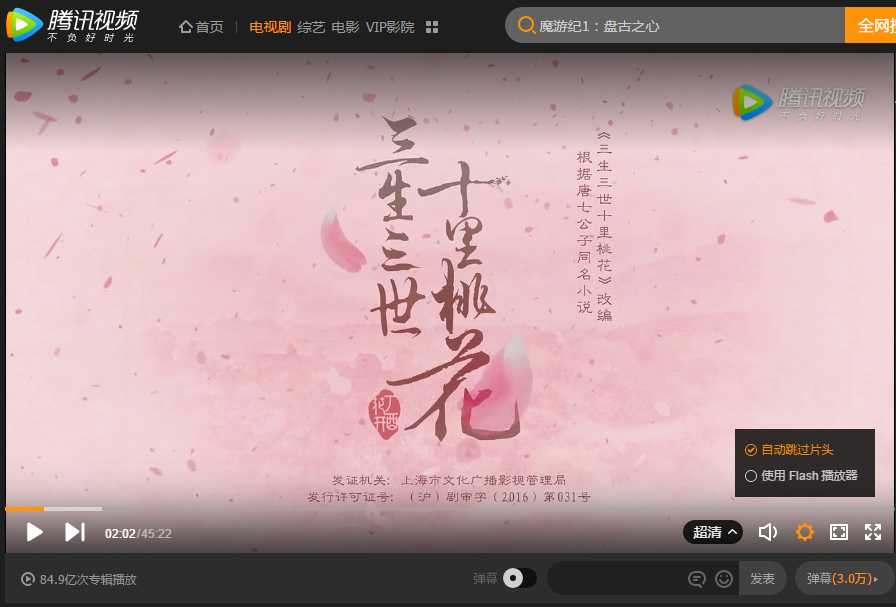
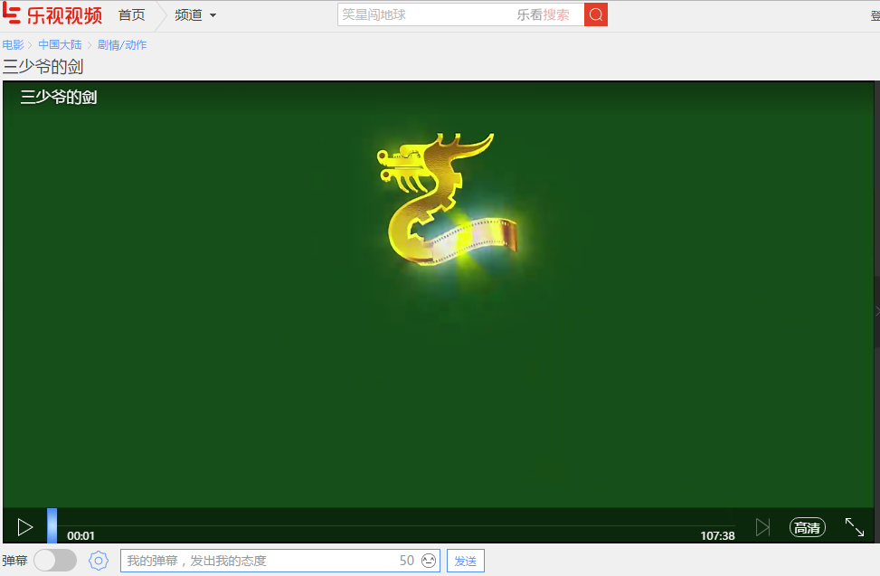

# TencentVideo-LeTV-HTML5Play
腾讯视频、乐视视频HTML5播放脚本，无广告看视频，安心省电，Mac电脑用户请忽略
  

### 使用截图 ###

腾讯视频：

乐视：

### 使用方法 ###

1. Chrome浏览器：下载安装插件 [点我下载](https://chrome.google.com/webstore/detail/tampermonkey/dhdgffkkebhmkfjojejmpbldmpobfkfo)
2. 安装脚本 [点我安装](https://raw.githubusercontent.com/kuaitou286/TencentVideo-LeTV-HTML5Play/master/TencentVideo-LeTV-HTML5Play.user.js)

### 注意事项 ###
IDM用户请添加排除项，以免不断弹出下载窗口，影响播放体验

| 视频网站 |              排除项              |
| ---- | :---------------------------: |
| 腾讯视频 | http:\/\/\*\/\*.tc.qq.com\/\* |
| 乐视视频 |          暂时没发现，以后补充           |

### 用户协议
MIT License
